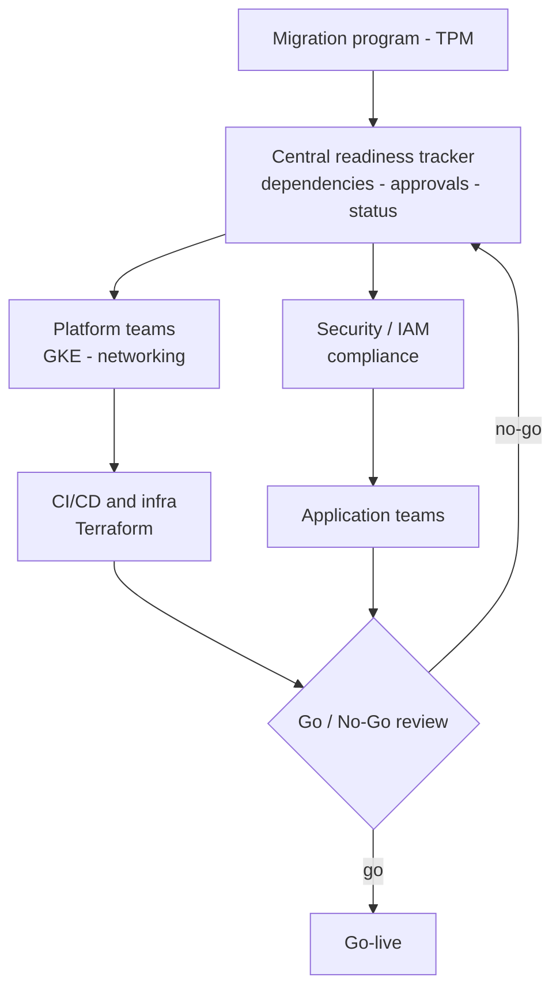

# Cloud Migration Readiness Framework

A centralized framework to track dependencies, approvals, and readiness across large-scale cloud migration programs. This repo ships the **actual artifacts**, not just a description: a readiness tracker, a dependency RACI, and a go/no-go checklist you can adapt.

> Based on real migration programs. Example rows in the tracker and RACI are illustrative placeholders, not real program data.

---

## The problem

Enterprise migrations involve dozens of interdependent components across platform, security, networking, and application teams. Without shared visibility into readiness, teams operate in silos, blockers surface late, and go-live risk compounds into missed timelines and reactive firefighting.

## The solution

A lightweight, centralized readiness and dependency model. It maps every component to its owner, dependencies, approval status, and Terraform maturity, prioritizes the critical path, and runs structured go/no-go governance so execution is predictable and low-risk.

## Architecture

## How it works

Each component is mapped to dependencies, approval status, and readiness level. The tracker aggregates inputs across teams and surfaces critical-path blockers. Governance checkpoints align platform, security, and application teams and force explicit go/no-go decisions before cutover.

## Artifacts in this repo

- `templates/readiness-tracker.csv` - per-component readiness, dependencies, approvals, critical-path flag
- `templates/dependency-raci.md` - responsibility matrix across migration workstreams
- `templates/go-no-go-checklist.md` - structured pre-cutover decision gate

## Tradeoffs and decisions

**Centralized tracking over decentralized ownership:** improves visibility and speeds decisions, at the cost of a single artifact that must be kept current.

**What I would do differently:** automate readiness signals from CI/CD instead of manual status updates, and add predictive risk scoring.

## What I learned

- Dependency management, not technology, is the true critical path.
- Transparency drives execution faster than process overhead.
- Lightweight governance scales better than heavy process.

## Next steps

- Automate readiness signals from pipelines
- Integrate dependency status from CI/CD
- Add predictive risk scoring

## Built with

Jira / tracking systems | Terraform | Cloud platforms

## Author

**Gaurav Kumar** | [LinkedIn](https://www.linkedin.com/in/gauravkumar2)
